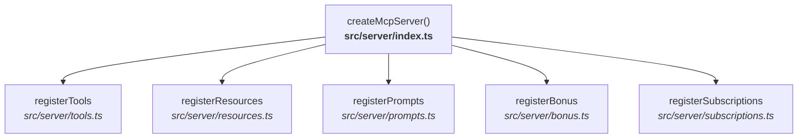
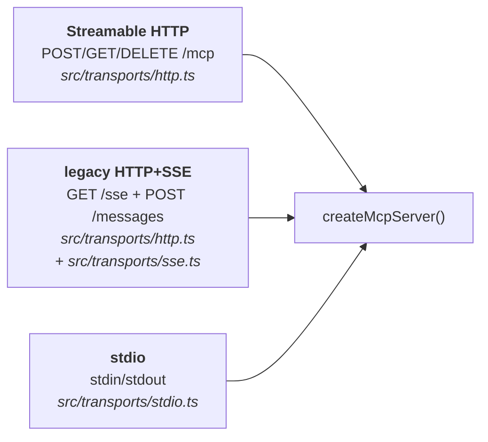
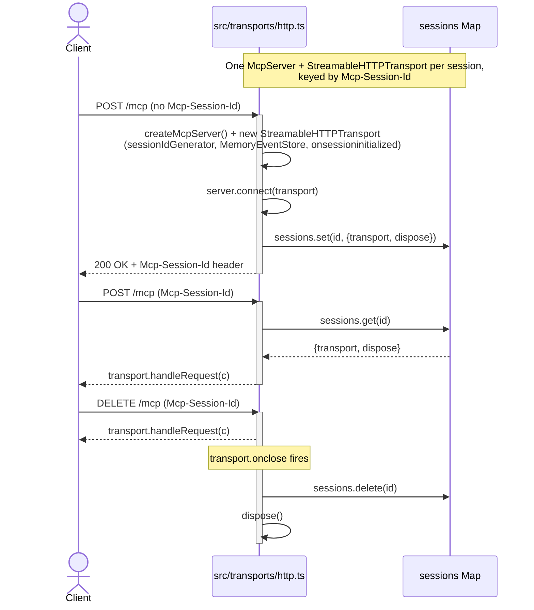
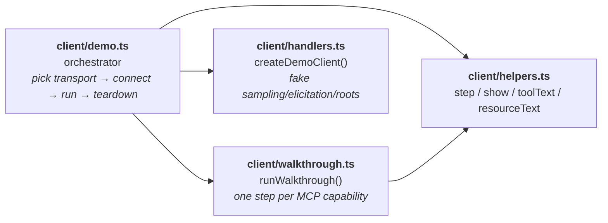

# Architecture

How `mcp-demo` is put together: the session model, the module split per MCP
capability family, and how the three transports share a single server factory.

## Big picture



`createMcpServer()` is the single entry point for assembling a fully-featured
demo server. Each capability family lives in its own module under `src/server/`
with one `register*` export. Adding a new feature means dropping in a new
module and one line in `src/server/index.ts` — no other file needs to change.

The same factory is used by **all three transports** (everything under
`src/transports/`):



So transports are purely a wire-layer concern; the capability surface is
identical across them.

## Session model

The server is **stateful**: each `initialize` gets its own `McpServer` +
`StreamableHTTPTransport`, keyed by the `Mcp-Session-Id` header.



Why per-session: subscriptions, log-level state, and the live-stats ticker all
need to be isolated per client. A fresh `createMcpServer()` per session gives
each client its own `subscribedUris` set, its own `setLevel`, and its own
`setInterval`.

The `dispose` returned by `createMcpServer()` (and transitively by
`registerSubscriptions`) clears that session's live-stats interval on close —
no leaked timers.

## Capability → module map

| MCP capability | Module | Notes |
| --- | --- | --- |
| Tools, progress, cancellation, sampling, elicitation, roots, logging | `src/server/tools.ts` | `registerTools` |
| Resources (static + templated + live) | `src/server/resources.ts` | `registerResources`; completion via `ResourceTemplate` callbacks |
| Prompts + argument completion | `src/server/prompts.ts` | `registerPrompts`; uses `completable()` |
| list_changed toggle | `src/server/bonus.ts` | bonus tool/resource/prompt + `toggle-bonus` |
| Resource subscriptions | `src/server/subscriptions.ts` | `registerSubscriptions`; SDK doesn't auto-track these |
| Fake in-memory data | `src/server/data.ts` | users + `liveStats` + `mutateLiveStats` |
| Shared helpers | `src/utils.ts` | `sleep` (AbortSignal-aware), `errorMessage` — also used by `client/` |
| Server factory | `src/server/index.ts` | `createMcpServer` orchestrator |
| HTTP + SSE + stdio wire layers | `src/transports/` | `http.ts` (Hono app), `sse.ts` (`HonoSseTransport`), `stdio.ts` |

## Client layout



`handlers.ts` is where the demo's "no real LLM" trick lives: it registers
client-side handlers for `sampling/createMessage`, `elicitation/create` and
`roots/list` that respond with canned data, so the walkthrough runs without
external services.

## Adding a new capability

1. Create `src/server/<feature>.ts` exporting `register<Feature>(server: McpServer)`.
2. Add one line to `src/server/index.ts`:
   ```ts
   register<Feature>(server)
   ```
3. (Optional) Add a walkthrough step in `client/walkthrough.ts`.

That's it — no transport code touches, because transports just pipe bytes to
the same `createMcpServer()`.

## Gotchas encoded in the code

- **Resource subscriptions aren't SDK-managed.** The SDK exposes
  `SubscribeRequestSchema` / `UnsubscribeRequestSchema` but doesn't track URIs
  — `src/server/subscriptions.ts` does it per-session.
- **Log-level filtering needs the session id.** `server.sendLoggingMessage(
  params, sessionId)` only filters when the session id is passed; without it
  the message bypasses the per-session level gate.
- **Don't override `ProgressNotificationSchema` on the client.** The SDK's
  internal handler routes progress to per-request `onprogress` callbacks;
  clobbering it breaks `long-task` progress. `handlers.ts` intentionally
  omits that handler.
- **stdio never logs to stdout.** stdout is the JSON-RPC wire — `src/transports/stdio.ts`
  uses `console.error` only.
- **SSE `MemoryEventStore` is in-memory only.** A Streamable HTTP session is
  non-resumable across a server restart; that's fine for a demo.