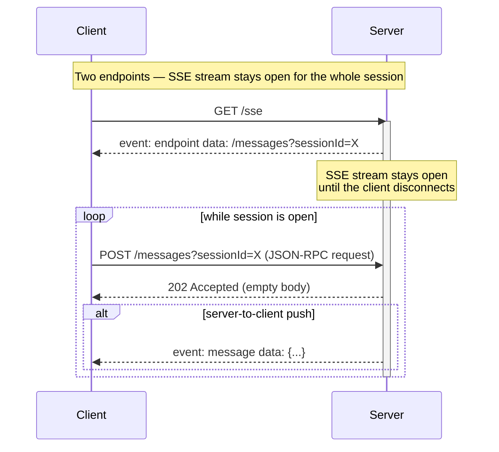

# HTTP+SSE transport (legacy)

> **Status: deprecated.** This was MCP's original remote transport (spec **2024-11-05**).
> It was replaced by [Streamable HTTP](./streamable-http.md) in spec **2025-03-26** and survives
> only for backward compatibility. This repo keeps it for education — see `src/transports/sse.ts`.

It uses **two HTTP endpoints** per server:

1. **`GET /sse`** — the client opens a long-lived
   [Server-Sent Events](https://developer.mozilla.org/en-US/docs/Web/API/Server-sent_events)
   stream (`text/event-stream`).
2. **`POST /messages`** — the client sends JSON-RPC messages as ordinary HTTP POSTs.

Key quirk: **POST responses carry no data** (just `202 Accepted`). Every server response — even
the direct answer to a request — is pushed asynchronously through the single SSE stream, matched
to its request by JSON-RPC id.

## Why MCP used it

When MCP launched, it needed a way to run **remote/shared servers** over plain web tech with
server→client push (for notifications, progress, sampling requests, …). SSE was the pragmatic
choice: simple HTTP, works through most proxies, natively supported by browsers.

## Why it was replaced

- **Two endpoints** to route, secure, and keep in sync — annoying behind load balancers and API
  gateways.
- **One pinned connection per session** — the SSE stream must stay open for the entire session,
  so horizontal scaling needs sticky sessions, and idle timeouts kill connections.
- **No resumability** — if the SSE stream drops, in-flight messages are lost; there is no
  replay mechanism.
- **Head-of-line bottleneck** — all server→client traffic (responses *and* unrelated
  notifications) is multiplexed over one stream.

Streamable HTTP fixes all of this while keeping SSE as an optional per-request upgrade.

## In this repo

- `src/transports/sse.ts` — a Hono/Bun-native implementation of the legacy wire protocol.
  (The SDK's own `SSEServerTransport` is Node-only, so we hand-rolled one — the class doubles
  as executable documentation of the protocol.)
- `src/transports/http.ts` — `GET /sse` + `POST /messages` routes
- `client/demo.ts sse` — runs the full capability walkthrough over it (`bun run client:sse`)
