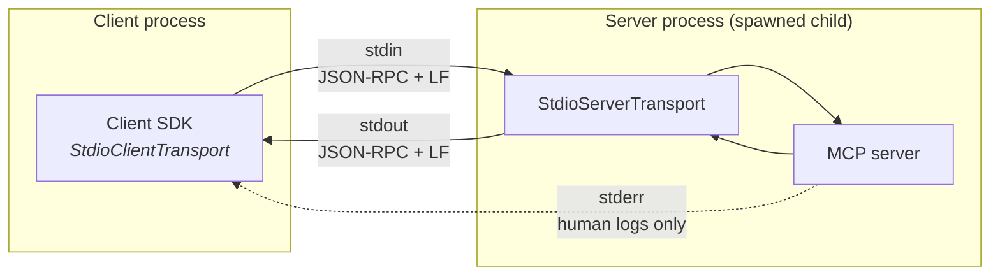

# stdio transport

The **stdio** transport runs the MCP server as a **child process** of the client and speaks
newline-delimited [JSON-RPC 2.0](https://www.jsonrpc.org/) over the process's standard streams:

- **stdin** — client → server messages (requests, notifications, responses)
- **stdout** — server → client messages (responses, notifications, requests)
- **stderr** — free for human-facing logs (never stdout, it would corrupt the protocol)

## Why MCP uses it

MCP's first design goal was connecting AI apps to **local tools** — filesystem searchers, git
helpers, database CLIs — distributed as ordinary packages (npm, pip, …). stdio fits perfectly:

- **Zero configuration** — no ports, URLs, TLS, or firewalls; the client just runs a command.
- **Security by inheritance** — the server runs as the user's own process with the user's
  permissions; there is no network surface to attack and no auth layer to configure.
- **Lifecycle for free** — the OS ties the server to the client: client exits → child dies →
  no orphaned servers.
- **Simple distribution** — "install this npm package and add one line of config" is how
  Claude Desktop, VS Code, Cursor, etc. launch local MCP servers today.

## Characteristics & limitations

| | |
|---|---|
| Topology | exactly 1 client per server process |
| Auth | none — relies on OS process permissions |
| Sessions / resumability | none (not applicable — the pipe *is* the session) |
| Streaming | full-duplex; notifications, progress, subscriptions all work |
| Footgun | any stray `console.log` in the server breaks the protocol — log to stderr |

**Use it when:** the server runs on the same machine as the client (local tools, editor/desktop
integrations). **Don't use it when:** the server must be shared, remote, or scaled — that's what
[Streamable HTTP](./streamable-http.md) is for.

## In this repo

- `src/transports/stdio.ts` — server entry point (`bun run stdio`)
- `client/demo.ts stdio` — the demo client spawns the server itself via `StdioClientTransport`
  (`bun run client:stdio`)
- Try it in the Inspector: `bunx @modelcontextprotocol/inspector bun run src/transports/stdio.ts`
