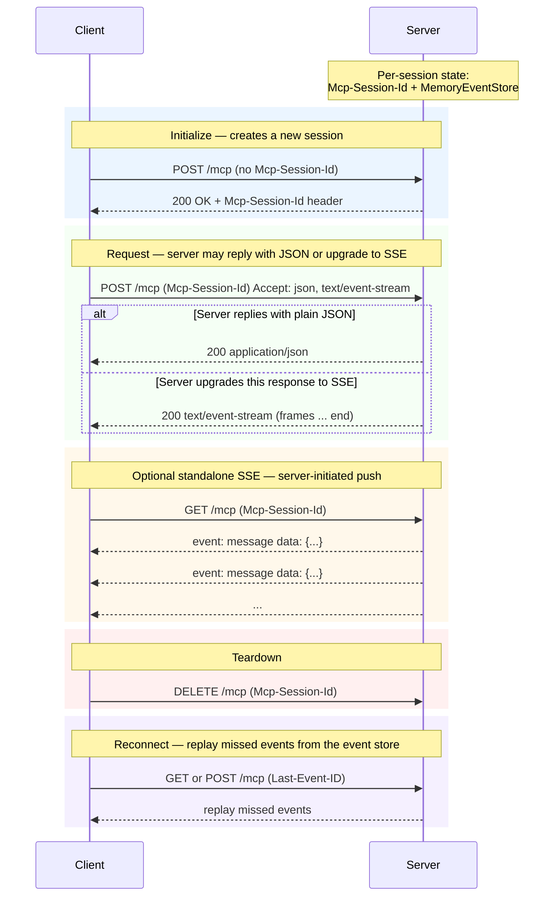

# Streamable HTTP transport (current standard)

> **Status: current.** Introduced in spec **2025-03-26**, replacing
> [HTTP+SSE](./sse.md). This is the transport to use for remote MCP servers today.

Streamable HTTP collapses the old two-endpoint design into **one endpoint** (conventionally
`/mcp`) and makes SSE an *optional, per-request* upgrade instead of a permanent connection:

## The pieces

- **`POST /mcp`** — carries JSON-RPC from the client. If the client accepts
  `text/event-stream`, the server may answer with plain JSON **or** keep that specific response
  open as an SSE stream (useful for streaming progress of the request being answered). The
  stream closes when the response is done — no permanently pinned connection.
- **`GET /mcp`** — optional *standalone* SSE stream for messages the server initiates outside
  any request (e.g. `notifications/resources/updated` for subscriptions). A server may refuse
  with `405` if it doesn't need it.
- **`Mcp-Session-Id` header** — returned at `initialize` for **stateful** servers; the client
  sends it on every subsequent request. Servers may also run **stateless** (no session id, fresh
  server per request) which suits serverless/edge deployments.
- **`DELETE /mcp`** — explicit session termination.
- **Resumability** — SSE frames carry event ids; the server keeps them in an *event store*, and
  a reconnecting client sends `Last-Event-ID` to replay what it missed.

## Why MCP uses it (i.e. why it beat SSE)

- **One endpoint** — trivial to route, proxy, and put behind gateways.
- **No head-of-line** — a response travels on its *own* request's stream instead of being
  multiplexed through one shared connection.
- **Scales** — stateless mode needs no sticky sessions; stateful mode only pins the optional
  GET stream.
- **Resumable** — reconnects replay missed messages instead of losing them.
- **Backward compatible** — plain-JSON responses mean even non-streaming clients work.

**Use it when:** the server is remote, shared, authenticated, or horizontally scaled.
**Skip it when:** the server is a local tool launched by the client — that's
[stdio](./stdio.md)'s job.

## In this repo

- `src/transports/http.ts` — the `/mcp` route with a per-session `StreamableHTTPTransport`
  (from `@hono/mcp`) and an in-memory `MemoryEventStore` for resumability
- `client/demo.ts` — the default walkthrough runs over it (`bun run client`)
- Try it in the Inspector: `bun run inspect` → connect to `http://localhost:3000/mcp`
